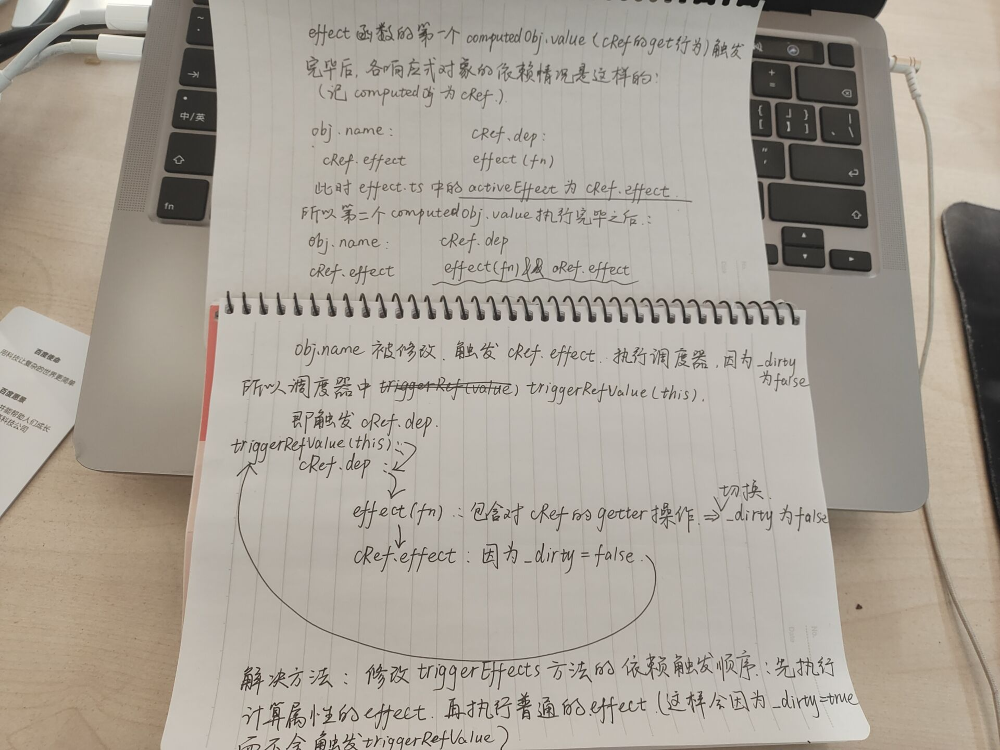

# 图解概要

# computed死循环原因分析

针对如下测试用例：

~~~html
<!DOCTYPE html>
<html lang="en">
  <head>
    <meta charset="UTF-8" />
    <meta http-equiv="X-UA-Compatible" content="IE=edge" />
    <meta name="viewport" content="width=device-width, initial-scale=1.0" />
    <title>Document</title>
    
  </head>
  <body>
    

  </body>
  
</html>
~~~

视图由张三变为李四后代码逻辑并不会停止，而是陷入死循环抱错：

代码逻辑分析：

1. 创建响应式对象`obj`
2. 创建`ComputedRefImpl`对象`computedObj`（简称`cRef`），`cRef`的`ReactiveEffect`对象简称为`cRef.effect`
3. 执行`effect(fn)`函数里的`fn`
   1. `---- 1 ----`处`computedObj.value`导致第一次触发`cRef`的get行为
      1. `effect`函数创建的`ReactiveEffect`依赖本身被`cRef`的`dep`收集
      2. 此时`_dirty`为`true`，`cRef.effect`执行`run`方法（**更新`activeEffect`为`cRef.effect`**），导致`cRef.effect`被`obj`收集（收集在`targetMap`中）
   2. `---- 2 ----`处`computedObj.value`导致第二次触发`cRef`的get行为
      1. `cRef`的get行为触发本身依赖收集，但是此时`activeEffect`为`cRef.effect`，所以导致**`cRef.dep`中收集了`cRef.effect`**（此时`cRef.dep`中有两个`reactiveEffect`对象，一个是effect函数手动创建的，一个是计算属性自己的effect）
4. `---- 3 ----`处`obj.name = 'xxx'`触发`targetMap`中的依赖，也就是`cRef.effect`，执行调度器，**`_dirty`为`false`，所以触发`cRef.dep`里的依赖，`cRef.dep`里存在`effect`方法手动创建的依赖和`cRef.effect`，先执行`effect`手动创建的依赖，触发`cRef`的get行为，使`_dirty`变为`false`，然后执行`cRef.effect`，**，重新触发`cRef.effect`走调度器的逻辑，因为此时`_dirty`又为`false`了，所以还是可以触发`cRef.dep`中的依赖，进入死循环。

# 解决方案

总而言之，是因为`ComputedRefImpl`对象的`ReactiveEffect`对象与普通的`ReactiveEffect`对象同时出现在了一个`Set`依赖集合中，进而导致`cRef.effect`修改`_dirty`后被普通依赖的`get`行为修改回来，又可以执行`triggerRefValue(this)`（被限制在脏变量内部）的逻辑

我们让`triggerEffects`触发依赖时对于`cRef`的依赖和普通的依赖分开执行（改为两个`for`循环，**先执行所有计算属性的依赖，再执行普通的依赖**）

~~~typescript
// 执行Set<effect>集合中所有effect相关的逻辑
export function triggerEffects(dep: Dep) {
  const effects = Array.isArray(dep) ? dep : [...dep]

  for (const effect of effects) {
    triggerEffect(effect)
  }
}
~~~

修改为：

~~~typescript
// 执行Set<effect>集合中所有effect相关的逻辑
export function triggerEffects(dep: Dep) {
  const effects = Array.isArray(dep) ? dep : [...dep]

  // 依次触发计算属性的依赖与普通依赖
  for (const effect of effects) {
    if (effect.computed) {
      triggerEffect(effect)
    }
  }
  for (const effect of effects) {
    if (!effect.computed) {
      triggerEffect(effect)
    }
  }
}
~~~

修改之后，进入`triggerRefValue(this)`的逻辑后，因为先执行计算属性的依赖，所以`triggerRefValue(this)`会因为`_dirty`的值不符合而不会被再次执行